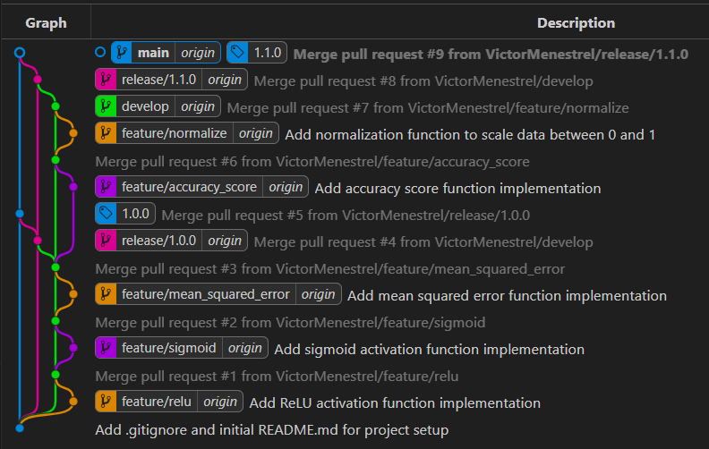

# Git Training Repository

The **Git-Training** repository is a personal practice space for improving my Git skills. It focuses on mastering branching, merging, and other essential version control techniques in a structured and organized way. This repository serves as a hands-on environment to experiment with different Git workflows and build confidence in managing code collaboratively.

---

## Branching Model in Action

Here is the branching model visualized in the repository:

- **Main Branch**: Contains stable, production-ready code.
- **Develop Branch**: Serves as the integration branch for ongoing work.
- **Release Branches**: Prepares features for production (e.g., `release/1.0.0`, `release/1.1.0`).
- **Feature Branches**: Dedicated to implementing specific tasks (e.g., `feature/normalize`, `feature/accuracy_score`).

---

## Repository Goals

1. **Branching and Workflow Mastery**:
   - Explore and implement the **main/release/develop/feature** branching model.
   - Practice creating, merging, and resolving conflicts between branches.

2. **Version Control Techniques**:
   - Experiment with pull requests and commit messages.
   - Build confidence in feature-based development and maintaining clean Git histories.

3. **Code as a Use Case**:
   - Implement simple functions to practice real-world version control.
   - Example functions include:
     - Normalization
     - Accuracy Score Calculation
     - Mean Squared Error
     - Sigmoid and ReLU Activation Functions

---

## Features and Functionality

1. **Feature Branches Implemented**:
   - `feature/relu`: Added ReLU activation function.
   - `feature/sigmoid`: Added Sigmoid activation function.
   - `feature/mean_squared_error`: Added Mean Squared Error calculation.
   - `feature/accuracy_score`: Added Accuracy Score calculation.
   - `feature/normalize`: Added data normalization function.

2. **Release Milestones**:
   - **v1.0.0**: Initial set of functions and workflows.
   - **v1.1.0**: Added normalization and accuracy score functions.

---

## Reflection

This repository has helped me:
- Gain hands-on experience with Git branching strategies.
- Understand the importance of structured workflows in team environments.
- Build better habits for commit messages, merges, and pull request practices.

Feel free to explore this repository and use it as inspiration for your own Git training journey!